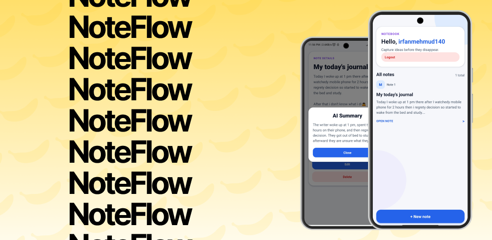

# NoteFlow

  

NoteFlow is a full-stack note-taking app for capturing, managing, and refining ideas from a focused mobile interface. It combines an Expo and React Native client with a TypeScript backend, secure authentication, persistent note storage, and AI-powered summaries.

## What it does

- Authenticates users with Clerk
- Lists notes belonging to the signed-in user
- Creates, reads, edits, and deletes notes
- Displays individual notes in a dedicated detail view
- Queues note-summary requests for background processing with BullMQ and Redis
- Generates concise summaries with LangChain and Groq (model configurable via `MODEL_NAME`)
- Shows summary progress while a background job is queued or processing
- Stores users, notes, and generated summaries in PostgreSQL via Prisma
- Validates environment variables at startup with Zod
- Provides structured logging with Pino and HTTP request logging
- Enforces consistent formatting with Prettier

The mobile client communicates with the protected notes API. The API validates the authenticated user, handles note operations, and places summarization requests on a BullMQ queue. A separate worker consumes those jobs, calls the Groq model through LangChain, and saves the resulting summary to the note.

## Tech stack

### Mobile

- Expo 55 and React Native
- Expo Router with typed routes
- Clerk Expo authentication
- Axios for API communication
- Zod for input and response validation
- TypeScript

### Server

- Bun and Express 5
- Clerk Express middleware for authentication
- PostgreSQL with Prisma 7 (pg adapter)
- Redis with BullMQ for background job queues
- LangChain and Groq for AI summarization
- LangSmith for tracing and observability
- Pino for structured logging with HTTP request logging
- Zod for runtime validation (env vars, request/response schemas)
- Prettier for code formatting
- TypeScript

## Main user flow

1. A user signs in through Clerk.
2. NoteFlow loads the user's notes from the API.
3. The user can create, edit, view, or delete a note.
4. From the note detail screen, the user can request an AI summary.
5. The server queues the request and the worker stores the completed summary.
6. The mobile client polls the job status and presents the summary when it is ready.

